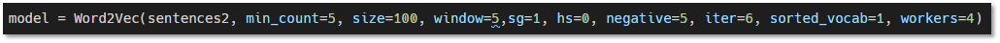

# unsupervised_nmt

https://github.com/artetxem/undreamt 의 비지도번역 방법을 바탕으로 영어 -한국어 간 번역을 구현해보았다. 

undeamt 모델 학습은 AWS gpu server에서 진행하였다

batch size 50 10000회에 대략4시간 소요

논문리뷰 내용은 [notion 참고](https://www.notion.so/Unsupervised-NMT-c0a3dcfce60f487fb1c60de2338962f6)

## 수정사항

[wiki](https://github.com/Changyoon-Lee/unsupervised_nmt/wiki) 참고

- 기존 undreamt pytorch 모델은 0.3v 기반으로 1.+ version에서 사용가능하도록 수정
- pre trained 모델 추가 학습 가능하도록 기능 및 parser 추가

## 진행 과정

### PREPROCESS

#### **version 1**

 [간단 전처리 + vecmap 진행버전](https://github.com/Changyoon-Lee/preprocess_undreamt_ko)

- ai hub 한국어 문장, wmt영문장 이용하여 빈도수에 따라 각각 50000개의 토큰 선별(en : nltk tokenizer/ ko: konlpy Okt tokenizer)
- 그 후 fastext common crawl 의 vector 값을 불러와 별도로 저장 한다

- 이 후 vecmap 실행하여 결과 값을 얻는다

==> 선별된 vocab 확인 시 불필요 단어 多, 중요 단어 부족 했음

한글 코퍼스의 부족성을 느껴서 추가적인 데이터가 필요하다고 느꼈고,

 vocab_size를 줄일 수 있는 Kkma tokenizer 사용하기로 함

#### **version2**

##### english corpus 

- [wmt14 news_crawl data](http://data.statmt.org/news-crawl/ ) 에서 500만 문장 추출 
- langdetect 패키지 이용하여 영문장만 필터링
- 전처리 및 주소 등 불필요 문장 제거

**korean corpus**

- [AI hub](https://www.aihub.or.kr/aidata/87/download) 한국어-영어 번역말뭉치의 한국어 문장 약 100만 문장

- 매일경제 (7가지 카테고리의 기사 crawl 및 전처리) 약 300만 문장

--> 전처리 작업 시간을 단축하기위해 병렬 처리([multiprocess](https://github.com/Changyoon-Lee/multiprocess) 참고)

### word2vec

gensim 패키지의 word2vec 진행 [word2vec 코드 참고](https://github.com/Changyoon-Lee/word2vec)

- Skip gram
- window_size : 5
- Negative_sampling : 5
- 최소 단어 등장횟수 : 5

**Dictionary**

각 코퍼스에서 빈도 높은 단어 추출

vecmap 정확도 향상을 위해 한글-영어 vocab set 5000개를 준비 하였고, 80%를 training, 20%를 test로 사용

google 번역 api를 이용하여 한글->영어->한글 번역 수행시 일치하는 단어들을 위주로 수집하였다.

### Vecmap 진행 결과

ft : fastext이용한 word vector

w2v : word2vec 이용한 word vector

| embedding       | 정확도 | coverage |
| --------------- | ------ | -------- |
| 한->영 ft       | 20.14  | 92.49    |
| 한->영 w2v      | 13.24  | 95.48    |
| 영->한 ft       | 20.24  | 93       |
| 영->한 w2v      | 17.05  | 95.07    |
| reference EN-ES | 35.6   | 100      |

### Undreamt 학습 진행

w2v이용한 embedding 값으로

AWS titan x gpu환경 50 batch_size로  50000회 진행 후 결과

## 결론

- 영어 - 한국어 간 문장 구성차이가 존재 하므로 기존 논문의 라틴계열 언어간 번역에 비해 정확도가 떨어졌을 것이다.
- 언어적 특성이 유사하다면 비교적 좋을 결과를 보일 것으로 보임